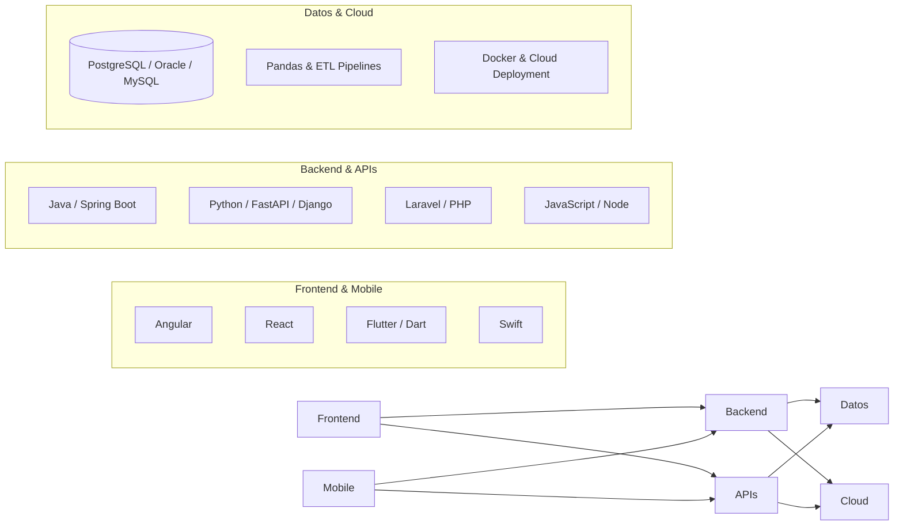

  

  ### Consultoría Tecnológica & Desarrollo de Software de Alto Impacto
  
  **Diseñamos y escalamos soluciones digitales empresariales, plataformas transaccionales y aplicaciones móviles nativas.**

  

    
  

   

  <!-- Backend, Móvil & Lenguajes Core -->
  
  
  
  
  
  
  
  
  

  <!-- Frontend, Datos & Cloud -->
  
  
  
  
  
  
  
  

---

## 🏢 Quiénes Somos

En **Atria.Software** transformamos procesos operativos complejos en herramientas digitales robustas, rápidas y escalables. Somos una firma de consultoría y desarrollo tecnológico con presencia en la **Ciudad de México** y **Pachuca, Hidalgo**, orientada al desarrollo de software empresarial a la medida para agencias automotrices, plataformas transaccionales de retail y sector salud.

---

## 📍 Cobertura y Localización

Brindamos consultoría y soporte de ingeniería tanto presencial como remoto:

* **Pachuca, Hidalgo**: Atención directa para concesionarios automotrices, comercios, talleres de servicio y empresas regionales.
* **Ciudad de México (CDMX)**: Consultoría técnica, desarrollo de plataformas empresariales e integraciones cloud para corporativos y pymes.

---

## 🛠️ Servicios Principales

### 📱 Desarrollo de Aplicaciones Móviles
* **Multiplataforma de alto rendimiento**: Aplicaciones nativas con **Flutter & Dart** para iOS y Android con sincronización en tiempo real y soporte offline total.
* **Desarrollo Nativo iOS**: Arquitecturas fluidas y seguras construidas en **Swift**.
* **Integración de hardware y sensores**: Escaneo óptico de series vehiculares (OCR con Google ML Kit), captura de firmas biométricas en pantalla e impresión térmica.

### 🌐 Aplicaciones Web & Plataformas Empresariales
* **Backends Críticos & Microservicios**: APIs seguras y de alto tráfico estructuradas en **Java (Spring Boot)**, **Python (FastAPI, Django)** y **Laravel**.
* **Procesamiento de Datos & Automatización**: Pipelines de normalización de datos, cruce de información y analítica operativa con **Python & Pandas**.
* **Frontends Modernos**: Interfaces dinámicas, accesibles y modulares desarrolladas con **Angular**, **React** y **JavaScript (ES6+) / TypeScript**.
* **Sistemas POS & CRM a la medida**: Control de inventario multi-almacén, conciliación de caja, dictámenes comerciales y trazabilidad de cartera.

### 🗄️ Migraciones de Bases de Datos & Optimización
* Migración de sistemas legacy hacia esquemas relacionales modernos (**Oracle DB**, **PostgreSQL**, **MySQL**).
* Limpieza, transformación (ETL) y refactorización de bases de datos sin interrumpir la operación continua del cliente.
* Ajuste de consultas SQL y diseño de índices para entornos de alta concurrencia.

---

## ⚙️ Desarrollo de Software a la Medida y Presupuesto

Diseñamos e implementamos herramientas operativas, plataformas web y aplicaciones móviles personalizadas según los procesos, infraestructura y presupuesto de cada empresa:

* **Sistemas Operativos y de Inspección en Campo**: Formularios inteligentes con captura de datos de clientes, escaneo óptico por cámara (**OCR**), inventarios de herramientas, mapeo visual de incidencias o diagnósticos y validación con **doble firma digital**.
* **Gestión Documental y Normativa**: Cotejo estricto de documentación de origen, historial de propietarios/arrendamientos, control de pagos o licencias y validación de expedientes en tiempo real.
* **Plataformas de Gestión Clínica y Expedientes**: Control de citas, historial médico/dental, módulos de caja y servicios para consultorios o clínicas privadas.
* **Control de Inventarios y Puntos de Venta (POS)**: Conexión multi-sucursal, control de stock, conciliaciones bancarias y trazabilidad de pedidos para comercializadoras y retail.
* **Portales Web Corporativos y Cotizadores en Línea**: Páginas de alto impacto optimizadas para captura de prospectos comerciales y cotización dinámica de servicios.

> 💡 **Enfoque Adaptable:** Desarrollamos software a la medida de tus objetivos comerciales y capacidad presupuestal, asegurando una integración transparente con las operaciones actuales de tu negocio.

---
## 🤝 Clientes y Casos de Éxito

Hemos colaborado activamente en la modernización tecnológica y operación diaria de empresas clave:

| Cliente | Sector | Soluciones Implementadas |
| :--- | :--- | :--- |
| **Toyota Pachuca** | Automotriz | Plataformas de atención, control de taller y encuestas CSAT. |
| **Subaru Pachuca** | Automotriz | Gestión digital, trazabilidad de clientes y seguimiento de leads. |
| **Carsline Pachuca** | Automotriz / Seminuevos | Sistemas operativos internos, inventario y despliegue en servidores. |
| **San Rafael Dental (CDMX)** | Sector Salud | Software de gestión clínica, control de expedientes y servicios web/desktop. |

---

## 💻 Stack Tecnológico

---

## 📬 Contacto y Colaboración

¿Tienes un proyecto en desarrollo, requieres consultoría especializada o buscas modernizar la infraestructura tecnológica de tu empresa? Contáctanos de forma directa:

 

 

| Canal | Detalle | Enlace Directo |
| :--- | :--- | :--- |
| 💬 **WhatsApp Directo** | Atención comercial y requerimientos técnicos | [Iniciar chat en WhatsApp](https://wa.me/527710000000?text=Hola%20Atria.Software,%20me%20gustar%C3%ADa%20cotizar%20un%20proyecto) |
| 📞 **Llamada / Oficina** | Línea de atención empresarial | [+52 771 000 0000](tel:+527710000000) |
| ✉️ **Correo Corporativo** | Envío de especificaciones y contratos | [contacto@atria.tech](mailto:contacto@atria.tech) |
| 🌐 **Portal Web** | Cotizador en línea y casos de estudio | [atria-tech.onrender.com](https://atria-tech.onrender.com/) |
| 📍 **Ubicaciones** | **Ciudad de México** • **Pachuca, Hidalgo** | Sesiones de trabajo presenciales o vía remota |

---

  © 2026 **Atria.Software** • Consultoría y Desarrollo Tecnológico Integral.

